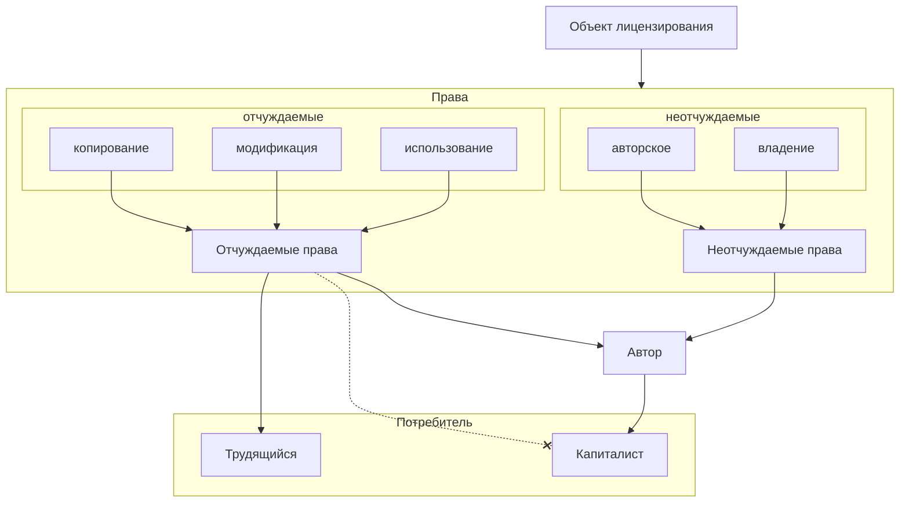

# Универсальная коммунистическая лицензия

`Версия 1.0.6` `2024-10-15 10:13:11 MSK +03`

Сокращённое название:

- русский: УТК;
- английский: UCL.

## Определения

**Трудящийся**: человек, для которого приоритетным способом обеспечения своей жизни является реализация своего производительного труда каким-либо образом.

**Капиталист**: человек, который является владельцем материальных и трудовых ресурсов, инструментов производства и присваивает в личное владение хотя бы часть прибавочной стоимости в ходе товарного производства.

**Объект лицензирования**: любой результат труда, в отношение которого устанавливаются правовые отношения настоящей лицензией (далее `ОЛ`); `ОЛ` не может быть ничего, кроме артефакта, который потребовал для своего создания производительного труда.

**Автор ОЛ**: человек (или несколько человек), который является автором `ОЛ` и всех сопутствующих материалов, которые он создал непосредственно.

**Потребитель ОЛ**: `трудящийся` или `капиталист`, который использует настоящий `ОЛ`, с соблюдением требований данной лицензии или с нарушением требований данной лицензии.

**Производный объект лицензирования**: `ОЛ` со всеми сопутствующими материалами, в котором доля модификации не превышает 50%; производный `ОЛ` подпадает под действие этих же лицензионных требований в полном объёме.

**Лицензионные требования**:требования на условия использование ОЛ, которые предъявляет автор ОЛ при его использовании потребителем ОЛ. `Лицензионные требования` автоматически вступают в силу, если потребитель ОЛ использует объект лицензирования в любым способом.

## Права

**Неотчуждаемое право**: такой вид права, который при любых условиях и/или обстоятельствах не может быть утрачен.

**Авторское право**: неотчуждаемое право автора (или группы авторов) на своё произведение ни при каких условиях; авторское право означает, что автором `ОЛ` является конкретный человек (или группа людей) и ничего более.

**Право владения**: особое, неотчуждаемое право в условиях капитализма, по непосредственному владению `ОЛ` `автором`; возможно отчуждаемое право в условиях социализма на свободном решении отказа  `автора` от права владения `ОЛ` в общественное пользование `трудящимися`.

**Отчуждаемое право**: такой вид права, который может быть передан или отозван по различным основаниям.

**Свободное решение**: решение двух сторон по обладанию отчуждаемыми правами без какого-либо внешнего давления, которое не принуждает любую из сторон  (с явной потерей своей пользы в явную пользу другой стороны или наоборот) передавать или принимать права любой из сторон.

**Право копирования**:  возможное отчуждаемое право, по  `свободному решению`` сторон; копирование -- создание копии ПО. подлежащее данным лицензионным требованиям.

**Право модификации**: возможное отчуждаемое право, по `свободному решению`` сторон; модификация -- доработка, декомпиляция. патчинг и другие виды изменений в отношении ПО, которое подлежит данному лицензированию.

**Право использования**: возможное отчуждаемое право, по свободному решению сторон; использование -- использование `ОЛ` по функциональному назначению _и все действия_, связанные с технологией использования такого `ОЛ`, подлежащему данным лицензионным требованиям; право использования для `капиталиста` -- -- особое индивидуальное разрешение `капиталисту` на использование конкретного `ЛО` или его частью, которое подлежит данным лицензионным требованиям.

## Обязанности сторон

`Автор` в рамках определений в настоящих лицензионных требований _разрешает_ всем `трудящимся` мира использовать права на настоящий `ОЛ`:

- копирования;
- использования;
- модификации.

`Автор` в рамках определений настоящих лицензионных требований _запрещает_ всем `капиталистам` мира право копирования, использования, модификации настоящего `ОЛ` и любые права не указанные здесь, если это не оговорено особо или передача прав не является свободной.

`Автор` _явно_ запрещает использование `ОЛ`, в случае его применения любым способом против `трудящихся`.

`Автор` не даёт _никаких_ гарантий в отношении настоящего `ОЛ`:

- необходимого функционала;
- необходимой архитектуры;
- необходимых архитектурных свойств;
- необходимого качества и/или кодирования, материалов;
- необходимого количества тестирования;
- необходимых возможностей масштабирования;
- отсутствия возможного ущерба;
- возможной упущенной выгоды;
- иных возможных потерь, которые не упомянуты здесь.

`Автор` может дать дополнительные гарантии по своему усмотрению или договорённости с `потребителем`; подобные договорённости оформляются отдельным приложением и оно имеет приоритет надо отказом от гарантий, перечисленными (или не упомянутыми) выше.

`Автор` гарантирует, что не включает в свой код деструктивный функционал, но оставляет за собой право ограничивать `потребителей` данного `ОЛ` в праве его использовать в случаях нарушения требований настоящей лицензии.

`Трудящиеся` _обязаны_ не передавать права на настоящий `ОЛ` `капиталистам` и не препятствовать передаче этих же прав `трудящимся`, кроме случаев _явного_ использования `трудящимися` настоящего `ОЛ` в пользу `капиталистов`.

В случае использования настоящего `ОЛ` `пользователи` автоматически принимают требования текущей УКЛ, и соглашаются со всеми положениями настоящих лицензионных требований.

Настоящая лицензия _должна_ сопровождать `ОЛ`, в случае передачи отчуждаемых прав.

## Защита лицензионных требований

`Автор` может в любой момент изменить состав `ОЛ` в любых целях, кроме откровенно деструктивных, для защиты лицензионных требований.
`Автор` может в любой момент изменить версию настоящих лицензионных требований, из-за внесённых им каких-либо изменений в `ОЛ`, но в рамках совместимости с предыдущими лицензионными требованиями.
`Автор` может в любой момент отозвать отчуждаемые права (кроме особых случаев отчуждаемого права использования), если посчитает, что `потребитель` нарушает настоящие лицензионные требования.

## Заключительные положения

Если, какая-либо сторона настоящих лицензионных требований не оговорена или допускает какую-либо трактовку -- в таком случае, ситуация трактуется приоритетно в пользу `автора`, во вторую очередь в пользу `трудящихся` и никогда в пользу `капиталистов`. Данное требование не распространяется на особые случаи использования с отдельными договорённостями и только на основе свободного решения.
